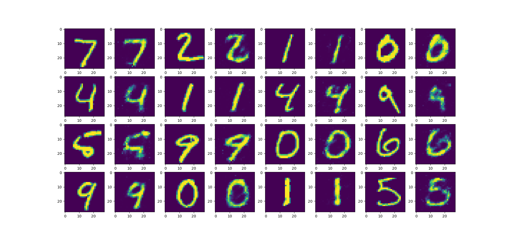

# Lossy data compression using an autoencoder

## Sample

First 16 number images from the MNIST dataset and their compressed versions.

Images firstly went through the learning process using a 784-350-80-350-784 layered autoencoder to generate the encoder/decoder parts of the densely connected neural network. Each image was then compressed from 784 floating-point number representation to a 80 floating-point representation to achieve roughly 90% compression ratio. From the following we generated the upper sample image using the decoder part of the neural net.

## Conclusion

As this is a generalized version that can compress any data, we would prefer to use a convolutional neural network structure on images to better preserve the relations of the neighboring pixels.

## Notes

This method is useful for permanent file storage, as new data can not be added without additional losses to quality of the compression of the added data or without retraining the network, which can be computationally expensive.

The MNIST dataset is not included, but is freely available on the internet.